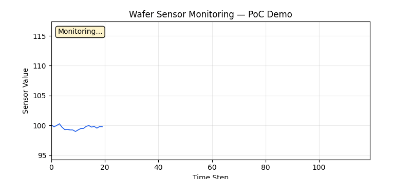
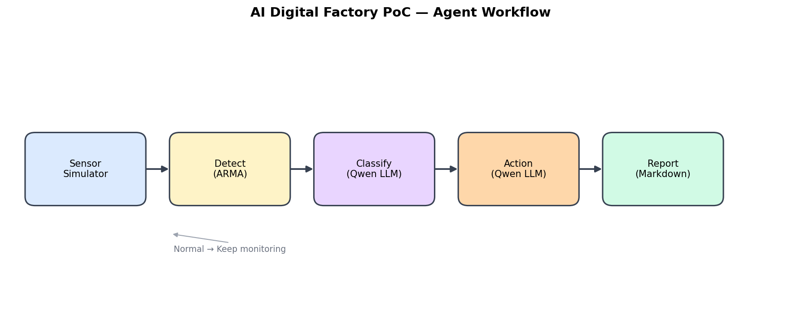

# AI Digital Factory PoC

### AI Agent-based Semiconductor Process Monitoring & Root Cause Analysis

> **반도체 Fab Digital Factory** 개념 검증(PoC) — 웨이퍼 센서 이상탐지부터 원인 분류·자동 대응까지 Agentic AI 파이프라인





---

## 프로젝트 배경 (Why)

반도체 Diffusion 공정에서는 FDC·센서 데이터 이상이 **수율·품질·장비 가동**에 직접 영향을 줍니다.  
현장에서는 이상 발생 시 엔지니어가 로그·센서·공정 파라미터를 수동으로 확인하고, 원인 추정과 대응 조치를 결정합니다. 이 과정은 반복적이고 시간이 소요됩니다.

본 PoC는 **Agentic AI**가 다음을 자동화할 수 있는지 검증합니다.

- 실시간 센서 모니터링
- 통계 기반 이상 탐지
- LLM 기반 **Root Cause 분류** (SPIKE / DRIFT / LOSS)
- Fab 대응 수준(Level 1~3) 결정 및 리포트 생성

---

## Digital Factory와의 연관성

SK하이닉스 **Digital Factory** 직무는 *Legacy System과 연계된 Agentic AI End-to-End 솔루션* 구축을 핵심으로 합니다.

| Digital Factory 요구 | 본 PoC 대응 |
|---------------------|-------------|
| Agentic AI 설계 | LangGraph StateGraph 기반 멀티스텝 Agent |
| 제조 데이터 분석 | ARMA(1,1) 시계열 + FDC-style 센서 시뮬레이션 |
| LLM 활용 업무 고도화 | Qwen3-0.6B 원인 분류·대응 결정 |
| 분석 → 실행 프로세스 | detect → classify → action → report 자동화 |
| Legacy 연계 (향후) | MES/FDC API 연동 확장 포인트 설계 |

> 단순 학습용 노트북이 아니라, **Fab 현장 Pain Point를 Agent로 풀어보는 개념 검증 프로젝트**입니다.

---

## 전체 아키텍처

```
┌─────────────────┐     ┌──────────────┐     ┌─────────────────────────────┐
│ Sensor Simulator│────▶│ Detect (ARMA)│────▶│ LangGraph Agent Orchestrator│
│  ARMA + Anomaly │     │  95% CI      │     │  classify → action → report │
└─────────────────┘     └──────────────┘     └─────────────────────────────┘
                                                          │
                              ┌────────────────────────────┼────────────────┐
                              ▼                            ▼                ▼
                         Qwen3-0.6B                  Action Level      Markdown Report
                      Root Cause Analysis            1 / 2 / 3
```

상세: [`docs/architecture.md`](docs/architecture.md)

---

## Agent Workflow

```
START → detect_node
          │
          ├─ [정상] → 모니터링 계속
          │
          └─ [이상] → classify_node → action_node → report_gen → END
```

| 단계 | Tool | 역할 | LLM |
|------|------|------|-----|
| 1 | `detect_anomaly` | ARMA 예측 + 95% CI 이상 판정 | ✗ |
| 2 | `classify_anomaly_cause` | SPIKE / DRIFT / LOSS 분류 | ✓ |
| 3 | `decide_action` | Level 1~3 대응 결정 | ✓ |
| 4 | `generate_report` | Markdown 리포트 생성 | ✗ |

---

## 사용 기술

| 구분 | 기술 |
|------|------|
| Agent Orchestration | LangGraph 0.2.x |
| LLM | HuggingFace **Qwen3-0.6B** (Colab GPU) |
| Tool Framework | LangChain `@tool` |
| Anomaly Detection | statsmodels ARMA(1,1), z=1.96 |
| Data | numpy, pandas |
| Visualization | matplotlib |
| Runtime | Google Colab (T4 GPU 권장) |

---

## 프로젝트 구조

```
AI_Fab_mini_prj/
├── README.md                 # 프로젝트 개요 (본 문서)
├── architecture.png          # 아키텍처 다이어그램
├── demo.gif                    # PoC 데모 애니메이션
├── requirements.txt
│
├── src/                        # 모듈 설계 (PoC 구현은 notebooks/)
│   ├── agents/                 # LangGraph Agent 정의
│   ├── tools/                  # detect / classify / action / report
│   └── prompts/                # LLM 시스템 프롬프트
│
├── notebooks/
│   └── AI_DigitalFactory.ipynb # ★ Colab 실행본
│
└── docs/
    ├── architecture.md         # 상세 아키텍처
    └── AI_DigitalFactory_개발정의.xlsx
```

---

## 실행 방법

### Colab (권장)

1. [`notebooks/AI_DigitalFactory.ipynb`](notebooks/AI_DigitalFactory.ipynb) 열기
2. **Runtime → Change runtime type → T4 GPU**
3. 셀 순서대로 실행
4. 빠른 검증: `LLM_PROVIDER = "mock"`
5. LLM 추론: `LLM_PROVIDER = "qwen"`

### 의존성

```bash
pip install -r requirements.txt
```

---

## 이상 유형 & 대응

| 분류 | 패턴 | 의심 원인 | 대응 |
|------|------|-----------|------|
| **SPIKE** | 급격한 변화 | 장비 이슈 | Level 2: 로트 격리 |
| **DRIFT** | 점진적 변화 | 공정 파라미터 이상 | Level 2: 엔지니어 통보 |
| **LOSS** | 결측/NaN | 센서 이슈 | Level 3: 장비 중단 |

---

## 향후 개선 계획

- [ ] **Legacy 연계** — MES / FDC / 장비 API 실데이터 ingest
- [ ] **RAG** — 공정·장비 매뉴얼 기반 Root Cause 근거 강화
- [ ] **Multi-Agent** — 공정별 전문 Agent 협업 (Diffusion / Etch 등)
- [ ] **FastAPI 서비스화** — Fab 현장 REST/streaming 모니터링
- [ ] **Digital Twin 연동** — 시뮬레이션 ↔ 실공정 피드백 루프
- [ ] **src/ 모듈화** — notebooks 코드를 production-ready 패키지로 분리

---

## License

MIT — see [LICENSE](LICENSE)
