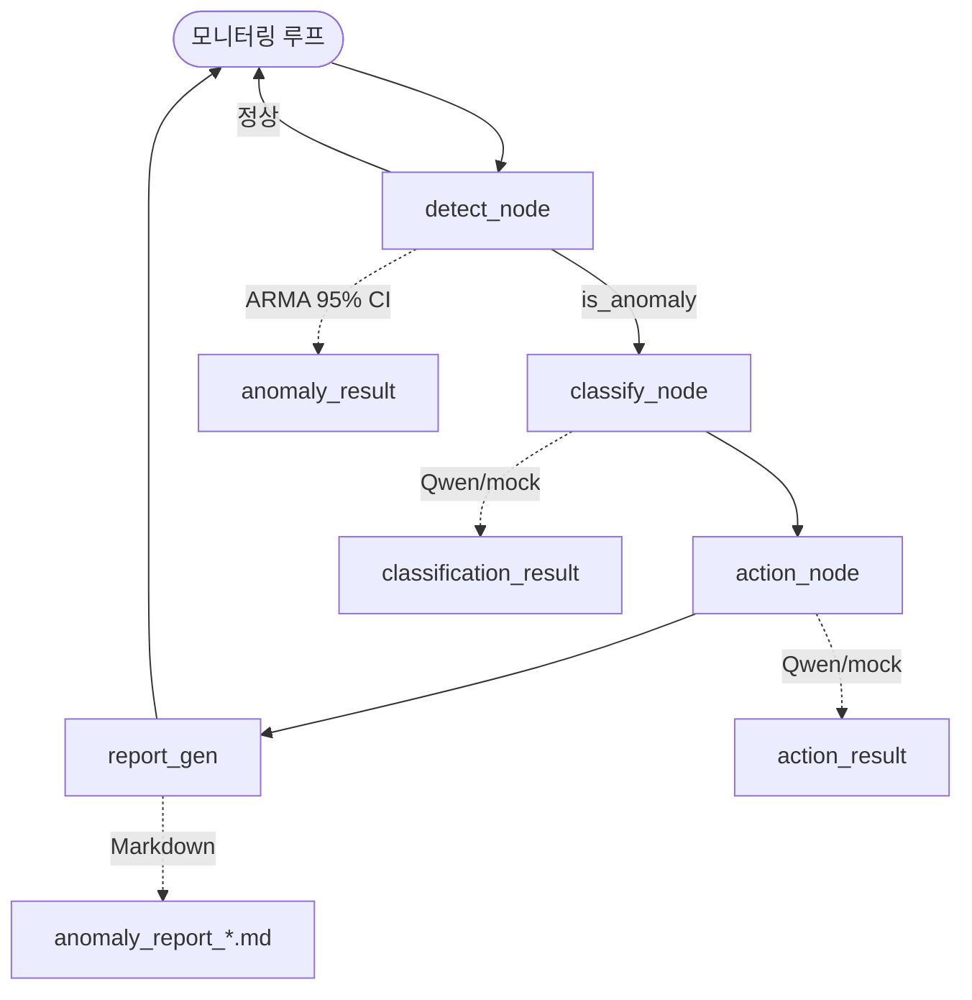

# AI Digital Factory — 웨이퍼 이상탐지 & 자동대응 Agent

반도체 Diffusion 공정 **웨이퍼 센서 데이터**를 모니터링하고, 이상 발생 시 **LangGraph Agent**가 원인 분류 → 대응 조치 → 리포트 생성까지 자동 수행하는 프로젝트입니다.

```
센서 시뮬레이터 → detect (ARMA) → [이상?] → classify (LLM) → action (LLM) → report
                                      ↓ 정상
                                   모니터링 계속
```

## 문제 정의

제조 Fab에서는 FDC·센서 데이터 이상이 수율·품질에 직결됩니다.  
본 프로젝트는 **Agentic AI**로 이상 탐지 후 원인(SPIKE/DRIFT/LOSS)을 분류하고, 대응 수준(Level 1~3)과 Markdown 리포트를 자동 생성합니다.

## 아키텍처



| 노드 | 역할 | LLM |
|------|------|-----|
| `detect_node` | ARMA(1,1) 예측 + 95% CI 이상 판정 | X |
| `classify_node` | SPIKE / DRIFT / LOSS 원인 분류 | O |
| `action_node` | Level 1~3 대응 조치 결정 | O |
| `report_gen` | Markdown 리포트 저장 | X |

## 기술 스택

| 구분 | 기술 |
|------|------|
| Orchestration | LangGraph 0.2.x (`StateGraph`) |
| LLM | **Qwen3-0.6B** (HuggingFace) / mock / Anthropic Claude |
| 이상탐지 | statsmodels ARMA(1,1), 95% CI (z=1.96) |
| 데이터 | numpy, pandas (시뮬레이션) |
| Notebook | Jupyter / **Google Colab** (T4 GPU 권장) |

## 프로젝트 구조

```
AI-DigitalFactory/
├── AI_DigitalFactory.ipynb          # Colab 메인 노트북
├── AI_DigitalFactory_개발정의.xlsx   # 셀/함수 개발 정의서
├── README.md
├── requirements.txt
├── .env.example
├── wafer_agent/
│   ├── main.py                      # CLI 진입점
│   ├── simulator.py                 # ARMA + 이상 주입
│   ├── llm.py                       # mock / qwen / anthropic
│   ├── config.py
│   ├── agent/graph.py               # LangGraph 정의
│   └── tools/
│       ├── detector.py              # Tool1: 이상탐지
│       ├── classifier.py            # Tool2: 원인 분류
│       ├── action.py                # Tool3: 대응 결정
│       └── reporter.py              # Tool4: 리포트
└── reports/                         # 생성 리포트 (gitignore)
```

## 빠른 시작

### Colab (권장)

1. `AI_DigitalFactory.ipynb` 열기
2. **Runtime → Change runtime type → T4 GPU**
3. 셀 순서대로 실행 (pip → GPU 확인 → 환경설정 → **Qwen 로드** → …)
4. 빠른 테스트: `LLM_PROVIDER = "mock"`
5. Qwen 사용: `LLM_PROVIDER = "qwen"`

### 로컬

```bash
pip install -r requirements.txt

# Mock (API/모델 없이)
LLM_PROVIDER=mock python3 -m wafer_agent.main --no-plot

# Qwen3-0.6B (GPU 권장)
LLM_PROVIDER=qwen python3 -m wafer_agent.main
```

### 환경 변수 (`.env.example` 참고)

| 변수 | 설명 |
|------|------|
| `LLM_PROVIDER` | `mock` \| `qwen` \| `anthropic` |
| `HF_MODEL_ID` | 기본 `Qwen/Qwen3-0.6B` |
| `ANTHROPIC_API_KEY` | anthropic 사용 시 |

## 이상 유형 & 대응

| 분류 | 패턴 | 의심 원인 | 대응 예시 |
|------|------|-----------|-----------|
| **SPIKE** | 급격한 수치 변화 | 장비 이슈 | Level 2: 로트 격리 |
| **DRIFT** | 점진적 변화 | 공정 파라미터 이상 | Level 2: 엔지니어 통보 |
| **LOSS** | 결측/NaN | 센서 이슈 | Level 3: 장비 중단 |

## 출력 예시

```
⚠️  step 334 | LOSS → Level 3
  [classify] LOSS (92%)
  [action] Level 3: 장비 중단 + 웨이퍼 재배치 지시
  [report] → anomaly_report_2026-01-01_05-34-00.md
```

## 설계 포인트

1. **이상탐지는 LLM 제외** — ARMA 통계 모델로 재현성·비용 확보
2. **LangGraph 조건부 엣지** — 정상이면 모니터링, 이상이면 classify→action→report
3. **Debounce + Cooldown** — 연속 이상 구간 중복 리포트 방지
4. **Colab 최적화** — Qwen 0.6B 로컬 추론, GPU/CPU 자동 선택

## 라이선스

MIT — see [LICENSE](LICENSE)
